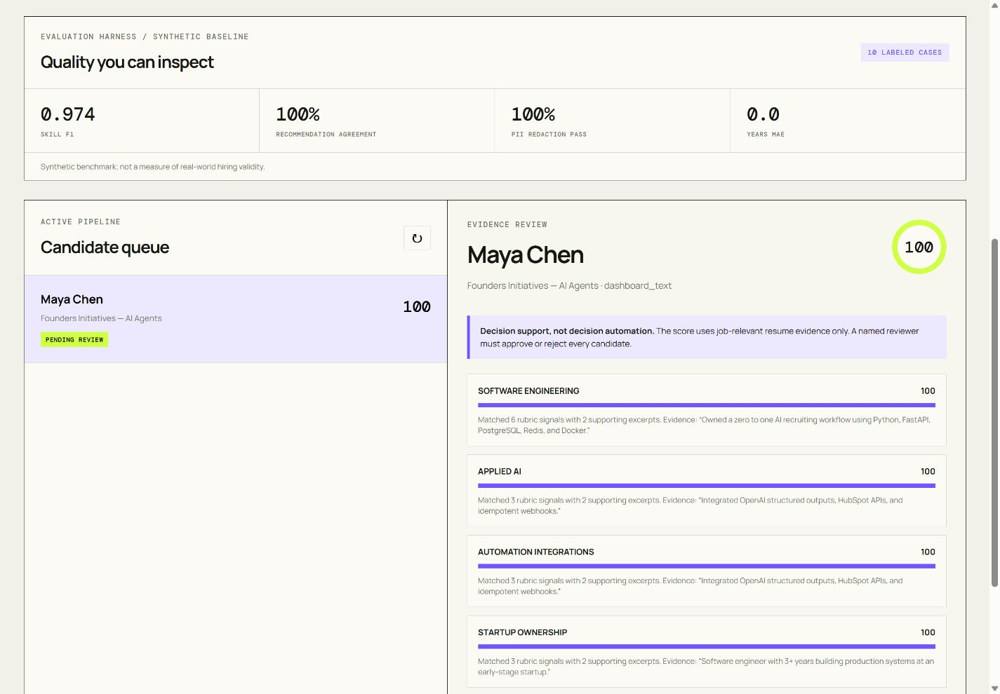
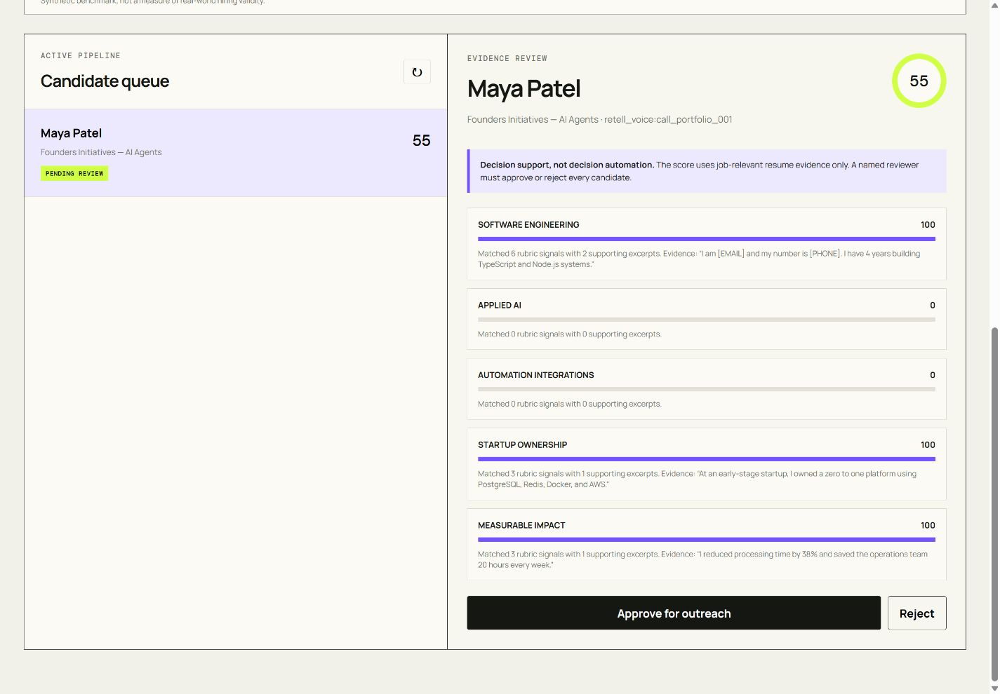
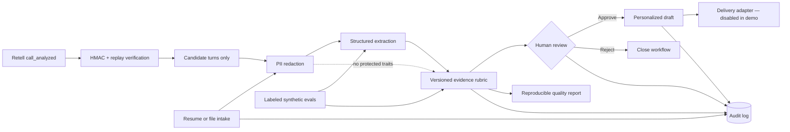

# FounderOps AI

[](https://github.com/DEWARAJ/founderops-ai/actions/workflows/ci.yml)

An auditable, human-in-the-loop candidate operations system built for high-ownership startup teams. It turns Retell voice interviews, TXT, PDF, DOCX, or pasted resumes into structured, evidence-backed signals, applies a versioned role rubric, and blocks outreach until a named reviewer makes the decision.

> This is decision-support software—not an automated hiring decision system. It does not score protected attributes, auto-reject candidates, or send messages without review.


<details>
<summary>View the privacy-aware candidate intake</summary>


</details>

<details>
<summary>View the evidence-backed review surface</summary>



</details>

<details>
<summary>View verified Retell voice evidence</summary>



</details>

## Why this project exists

Fast-growing teams need more than an LLM wrapper. They need reliable workflows: privacy boundaries, explicit state transitions, idempotency, human approvals, provider fallbacks, and an audit record. FounderOps AI demonstrates that complete operating surface.

## What is implemented

- Resume PII redaction before extraction and scoring
- Signed Retell `call_analyzed` webhook intake with replay protection and retry idempotency
- Candidate-only transcript extraction that excludes voice-agent prompts from scoring
- Secure TXT, PDF, and DOCX resume ingestion with type, size, and content validation
- Deterministic offline extractor for a zero-cost, reproducible demo
- Optional OpenAI Responses API adapter with strict JSON Schema output
- Versioned, evidence-based role rubric with per-dimension explanations
- Packaged 10-case labeled evaluation harness with API and CLI reports
- Mandatory named human approval before outreach drafting
- SQLite persistence, idempotent ingestion, and immutable audit events
- Responsive operations dashboard and documented FastAPI endpoints
- Tests covering safety gates, workflow transitions, privacy, and idempotency

## System flow



## Run locally

```bash
uv sync --extra dev
uv run founderops
```

Open `http://127.0.0.1:8000`. Click **New candidate** to load the synthetic demo resume, then inspect the scorecard, approve it, and draft outreach. API documentation is at `http://127.0.0.1:8000/docs`.

The intake accepts `.txt`, `.pdf`, and `.docx` files up to 5 MB. File contents are validated and parsed locally before the same privacy and evidence workflow runs.

For voice intake, set `RETELL_WEBHOOK_API_KEY` and register `/api/integrations/retell/webhook` for Retell's `call_analyzed` event. See the complete [Retell integration guide](docs/retell-integration.md), including the signed local fixture.

The default `deterministic` provider requires no account or API key. To use the optional OpenAI adapter:

```bash
set FOUNDEROPS_PROVIDER=openai
set OPENAI_API_KEY=your_key
set OPENAI_MODEL=your_structured_output_model
uv run founderops
```

The adapter uses the Responses API, disables response storage, and sends the redacted resume—not the original—to the provider. See the official [Responses API reference](https://developers.openai.com/api/reference/resources/responses/methods/create).

## Evaluation harness

Run the packaged benchmark without credentials:

```bash
uv run founderops-eval
```

Current deterministic baseline on 10 labeled synthetic resumes:

| Metric | Result |
|---|---:|
| Skill extraction precision | 1.000 |
| Skill extraction recall | 0.949 |
| Skill extraction F1 | 0.974 |
| Years-of-experience MAE | 0.0 |
| Recommendation agreement | 100% |
| PII redaction pass rate | 100% |

The dataset lives in `evals/candidate_profiles.jsonl`; every record declares its expected skills, experience, recommendation, and PII sentinels. These are synthetic regression results—not a claim about hiring validity or real-world model performance. The same live report is available in the dashboard and API.

## API

| Method | Endpoint | Purpose |
|---|---|---|
| `POST` | `/api/candidates` | Redact, extract, score, and queue for review |
| `POST` | `/api/candidates/upload` | Validate and ingest a TXT, PDF, or DOCX resume |
| `GET` | `/api/candidates` | List the active pipeline |
| `GET` | `/api/evaluations/benchmark` | Run the packaged synthetic regression benchmark |
| `POST` | `/api/integrations/retell/webhook` | Verify and ingest an analyzed Retell voice call |
| `POST` | `/api/candidates/{id}/review` | Record a named approve/reject decision |
| `POST` | `/api/candidates/{id}/outreach` | Draft outreach after approval only |
| `GET` | `/api/candidates/{id}/audit` | Inspect the workflow event trail |

Use an `Idempotency-Key` header on intake requests to make client retries safe.

## Engineering decisions

- **Mock-first provider boundary:** reviewers can run the entire workflow without credentials; the LLM adapter is replaceable.
- **Evidence before score:** every dimension exposes the matched evidence and missing signals. A score without support becomes `insufficient_evidence`.
- **Human gate in the domain layer:** the API and dashboard cannot bypass approval because the workflow state machine enforces it.
- **Untrusted voice boundary:** raw-body HMAC verification, a five-minute signature window, idempotent retries, candidate-only turns, and no transcript persistence.
- **Measured, disclosed quality:** benchmark numbers come from a versioned synthetic dataset and are explicitly separated from real-world hiring validity.
- **SQLite for the portfolio demo:** the repository interface isolates persistence so PostgreSQL can replace it without changing the workflow.

## Development

```bash
uv run ruff check .
uv run pytest
uv run founderops-eval
```

## Responsible-use boundary

FounderOps AI is designed for candidate prioritization and review assistance. Before any real deployment, add organization-specific access control, retention/deletion policy, consent and notice flows, bias evaluation with qualified counsel, encrypted secret storage, and validated integrations. A human remains accountable for every employment decision.

## License

MIT
